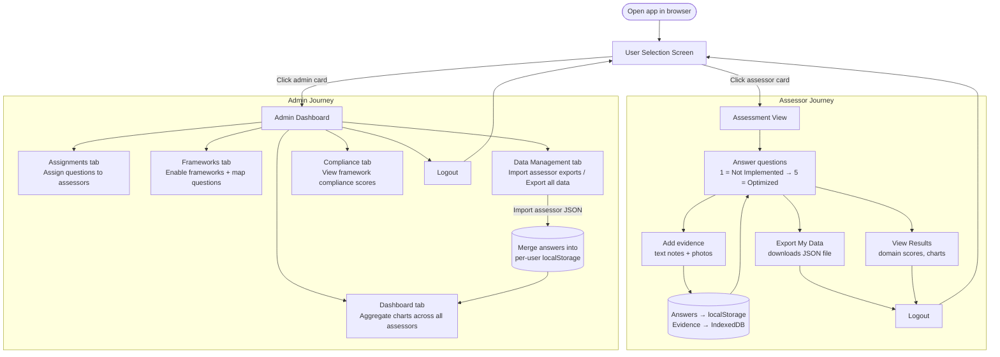
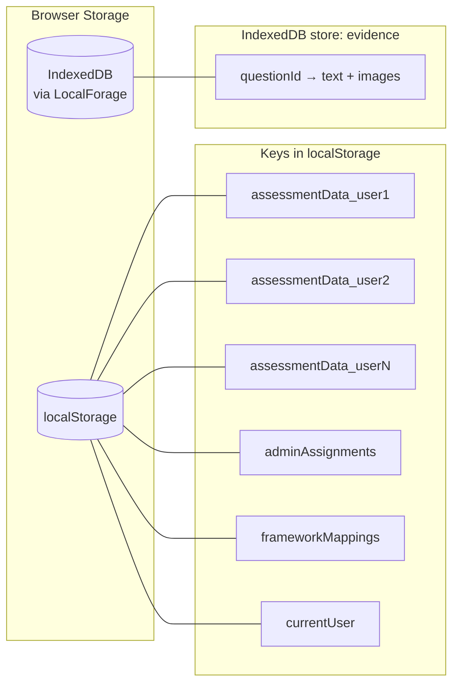

# Application Flow

This app runs entirely in the browser — no backend, no database.
All data is stored in the user's browser:
- **localStorage** — question answers (keyed per user)
- **IndexedDB** (via LocalForage) — evidence files (text + images)

Nothing leaves the device unless the user explicitly exports a file.

---

## Overall Workflow

---

## Storage Architecture

---

## Multi-Assessor Data Collection

Because the app has no server, the typical workflow for collecting responses
from multiple people is one of these:

### Option A — Shared device (pass the laptop/tablet)
1. Admin sets up question assignments
2. Each assessor selects their name, answers their questions, exports their JSON, logs out
3. Admin logs in, imports each JSON export via **Data Management → Import**
4. Admin views consolidated results in **Dashboard** and **Compliance** tabs

### Option B — Individual devices
1. Each assessor opens the GitHub Pages URL on their own device
2. They answer questions and export their JSON
3. They send the JSON file to the admin
4. Admin imports each file as above

### Data never leaves the browser automatically
- Answers are saved to `localStorage` on every keystroke — no submit needed
- Evidence images are stored in IndexedDB as base64
- Export is explicit: user clicks "Export My Data" to produce a portable JSON snapshot

---

## Route Map

| URL hash            | View                                      |
|---------------------|-------------------------------------------|
| *(none)*            | User Selection Screen (no user logged in) |
| `#`                 | Assessment (question answering)           |
| `#results`          | Personal results with charts              |
| `#admin`            | Admin → Domains tab                       |
| `#admin/frameworks` | Admin → Frameworks + question mapping     |
| `#admin/users`      | Admin → User management                   |
| `#admin/questions`  | Admin → Question management               |
| `#admin/assignments`| Admin → Assign questions to assessors     |
| `#admin/dashboard`  | Admin → Aggregate maturity charts         |
| `#admin/compliance` | Admin → Compliance framework scores       |
| `#admin/data-management` | Admin → Import / Export / Clear     |

All routing is hash-based — compatible with static GitHub Pages hosting.
