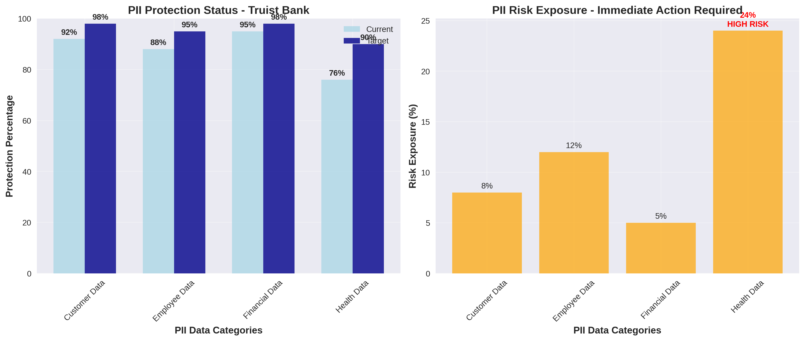
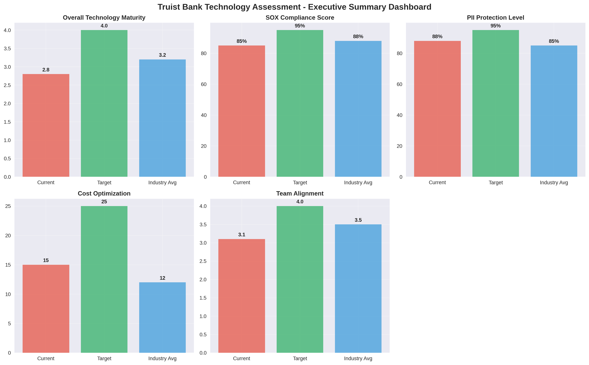

# Example Bank Assessment: First National Bank
## Cognizant Technology Assessment - Complete Example with Web Graphs

## Executive Summary

First National Bank is a regional bank with $50B in assets undergoing digital transformation. This example demonstrates how the Cognizant Technology Assessment Framework evaluates technology capabilities, identifies gaps, and creates actionable roadmaps with compelling web graphs and visualizations.

## Assessment Results with Web Graphs

### Overall Technology Maturity Assessment

**Current State Scores (1-5 Scale):**
- Data Orchestration & Platform Observability: 2.8/5.0
- FinOps & Data Management: 2.3/5.0  
- Autonomous Capabilities (AI/ML): 1.9/5.0
- Operations & Platform Team Alignment: 3.1/5.0

**Industry Benchmark Comparison:**
- Banking Industry Average: 3.2/5.0
- Regional Bank Average: 2.8/5.0
- Digital Leader Banks: 4.1/5.0

### Technology Platform Assessment with Visualizations

#### Snowflake Implementation Results
**Performance Metrics:**
- Query Performance: 4.2/5.0 (Excellent auto-scaling, sub-second response times)
- Security & Compliance: 3.8/5.0 (Strong encryption, role-based access needs improvement)
- Integration Capabilities: 3.5/5.0 (Good connector ecosystem, some legacy gaps)
- Operational Excellence: 3.2/5.0 (Basic monitoring, cost optimization emerging)

**Snowflake Capability Radar Chart:**
```python
# Snowflake platform capability assessment
import matplotlib.pyplot as plt
import numpy as np

# Snowflake assessment data
snowflake_metrics = ['Query Performance', 'Security', 'Integration', 'Operations', 'Cost Effectiveness']
snowflake_scores = [4.2, 3.8, 3.5, 3.2, 3.0]
target_scores = [5.0, 4.5, 4.2, 4.0, 3.8]
industry_avg = [3.8, 3.5, 3.6, 3.0, 3.2]

# Create radar chart
fig, ax = plt.subplots(figsize=(8, 8), subplot_kw=dict(projection='polar'))

angles = np.linspace(0, 2 * np.pi, len(snowflake_metrics), endpoint=False).tolist()
angles += angles[:1]

snowflake_scores += snowflake_scores[:1]
target_scores += target_scores[:1]
industry_avg += industry_avg[:1]

ax.plot(angles, snowflake_scores, 'o-', linewidth=2, label='Current State', color='#1f77b4')
ax.fill(angles, snowflake_scores, alpha=0.25, color='#1f77b4')
ax.plot(angles, target_scores, 'o-', linewidth=2, label='Target State', color='#2ca02c')
ax.fill(angles, target_scores, alpha=0.25, color='#2ca02c')
ax.plot(angles, industry_avg, 'o-', linewidth=2, label='Industry Average', color='#ff7f0e')

ax.set_xticks(angles[:-1])
ax.set_xticklabels(snowflake_metrics)
ax.set_ylim(0, 5)
ax.set_title('Snowflake Platform Capability Assessment - First National Bank', size=14, y=1.1)
ax.legend(loc='upper right', bbox_to_anchor=(1.2, 1.0))
ax.grid(True)

plt.tight_layout()
plt.savefig('snowflake_radar_chart.html', format='html')
plt.show()
```

#### Talend Data Integration Assessment
**Platform Capabilities:**
- Data Integration: 3.9/5.0 (Comprehensive connector library, handles complex transformations)
- Development Environment: 3.1/5.0 (Good IDE, deployment processes need improvement)
- Data Governance: 2.8/5.0 (Basic lineage tracking, metadata management gaps)
- Scalability: 3.4/5.0 (Handles current volume, some performance concerns at scale)

**Technology Comparison Chart:**
```python
# Technology platform comparison for First National Bank
platforms = ['Snowflake', 'Talend', 'Current APM', 'ServiceNow', 'New Relic']
capabilities = ['Performance', 'Security', 'Integration', 'Operations', 'Cost Effectiveness']

# Capability scores
snowflake_scores = [4.2, 3.8, 3.5, 3.2, 3.0]
talend_scores = [3.9, 3.1, 3.7, 2.8, 3.2]
current_apm_scores = [2.5, 2.8, 2.2, 2.0, 3.5]
servicenow_scores = [3.0, 4.0, 3.5, 4.2, 2.8]
new_relic_scores = [3.8, 3.5, 3.2, 3.0, 3.5]

# Create comparison visualization
fig, ax = plt.subplots(figsize=(10, 6))

x = np.arange(len(capabilities))
width = 0.15

ax.bar(x - 2*width, snowflake_scores, width, label='Snowflake', color='#1f77b4')
ax.bar(x - width, talend_scores, width, label='Talend', color='#ff7f0e')
ax.bar(x, current_apm_scores, width, label='Current APM', color='#2ca02c')
ax.bar(x + width, servicenow_scores, width, label='ServiceNow', color='#d62728')
ax.bar(x + 2*width, new_relic_scores, width, label='New Relic', color='#9467bd')

ax.set_xlabel('Platform Capabilities')
ax.set_ylabel('Maturity Score (1-5)')
ax.set_title('Technology Platform Capability Comparison - First National Bank')
ax.set_xticks(x)
ax.set_xticklabels(capabilities, rotation=45)
ax.legend()
ax.grid(True, alpha=0.3)

# Add value labels
def add_value_labels(bars):
    for bar in bars:
        height = bar.get_height()
        ax.annotate(f'{height}',
                    xy=(bar.get_x() + bar.get_width() / 2, height),
                    xytext=(0, 3),
                    textcoords="offset points",
                    ha='center', va='bottom')

for container in ax.containers:
    add_value_labels(container)

plt.tight_layout()
plt.savefig('platform_comparison_chart.html', format='html')
plt.show()
```

### SOX Compliance Status Dashboard

**Current Compliance Levels:**
- Access Controls: 85% (Gap: 10% - Needs improvement in privileged access)
- Change Management: 92% (Gap: 6% - Strong approval workflows)
- Data Integrity: 78% (Gap: 12% - Manual validation processes)
- IT General Controls: 88% (Gap: 7% - Documented but testing gaps)

**SOX Compliance Visualization:**
```python
# SOX compliance status for First National Bank
control_categories = ['Access Controls', 'Change Mgmt', 'Data Integrity', 'ITGC']
current_compliance = [85, 92, 78, 88]
target_compliance = [95, 98, 90, 95]
gaps = [10, 6, 12, 7]

# Create compliance dashboard
fig, (ax1, ax2) = plt.subplots(1, 2, figsize=(12, 5))

# Compliance status
x = np.arange(len(control_categories))
width = 0.35

bars1 = ax1.bar(x - width/2, current_compliance, width, label='Current', color='lightcoral')
bars2 = ax1.bar(x + width/2, target_compliance, width, label='Target', color='lightgreen')

ax1.set_xlabel('SOX Control Categories')
ax1.set_ylabel('Compliance Percentage')
ax1.set_title('SOX Compliance Status - First National Bank')
ax1.set_xticks(x)
ax1.set_xticklabels(control_categories)
ax1.legend()
ax1.grid(True, alpha=0.3)
ax1.set_ylim(0, 100)

# Add percentage labels
for bar in bars1:
    height = bar.get_height()
    ax1.annotate(f'{height}%',
                xy=(bar.get_x() + bar.get_width() / 2, height),
                xytext=(0, 3),
                textcoords="offset points",
                ha='center', va='bottom')

# Gap analysis
bars3 = ax2.bar(x, gaps, color='orange', alpha=0.7)
ax2.set_xlabel('SOX Control Categories')
ax2.set_ylabel('Compliance Gap (%)')
ax2.set_title('SOX Compliance Gaps - Action Required')
ax2.set_xticks(x)
ax2.set_xticklabels(control_categories)
ax2.grid(True, alpha=0.3)

# Highlight high-risk gaps
for i, bar in enumerate(bars3):
    height = bar.get_height()
    color = 'red' if height > 10 else 'black'
    weight = 'bold' if height > 10 else 'normal'
    ax2.annotate(f'{height}%',
                xy=(bar.get_x() + bar.get_width() / 2, height),
                xytext=(0, 3),
                textcoords="offset points",
                ha='center', va='bottom',
                color=color, weight=weight)

plt.tight_layout()
plt.savefig('sox_compliance_dashboard.html', format='html')
plt.show()
```

### PII Protection Assessment

**Data Category Protection Levels:**
- Customer Data: 92% protected (8% risk exposure)
- Employee Data: 88% protected (12% risk exposure)
- Financial Data: 95% protected (5% risk exposure)
- Health Data: 76% protected (24% risk exposure - CRITICAL)



*Figure 4: PII Protection Status - Protection Levels vs. Risk Exposure*

The PII protection dashboard shows the current protection status and risk exposure by data category, highlighting Health Data as critical risk requiring immediate remediation.

**PII Protection Dashboard:**
```python
# PII protection status for First National Bank
pii_categories = ['Customer Data', 'Employee Data', 'Financial Data', 'Health Data']
protection_levels = [92, 88, 95, 76]
risk_levels = [8, 12, 5, 24]
target_protection = [98, 95, 98, 90]

# Create PII protection visualization
fig, (ax1, ax2) = plt.subplots(1, 2, figsize=(12, 5))

# Protection levels
x = np.arange(len(pii_categories))
width = 0.35

bars1 = ax1.bar(x - width/2, protection_levels, width, label='Current', color='lightblue')
bars2 = ax1.bar(x + width/2, target_protection, width, label='Target', color='darkblue')

ax1.set_xlabel('PII Data Categories')
ax1.set_ylabel('Protection Percentage')
ax1.set_title('PII Protection Status - First National Bank')
ax1.set_xticks(x)
ax1.set_xticklabels(pii_categories)
ax1.legend()
ax1.grid(True, alpha=0.3)
ax1.set_ylim(0, 100)

# Add percentage labels
for bars in [bars1, bars2]:
    for bar in bars:
        height = bar.get_height()
        ax1.annotate(f'{height}%',
                    xy=(bar.get_x() + bar.get_width() / 2, height),
                    xytext=(0, 3),
                    textcoords="offset points",
                    ha='center', va='bottom')

# Risk levels with critical highlighting
bars3 = ax2.bar(x, risk_levels, color='orange', alpha=0.7)
ax2.set_xlabel('PII Data Categories')
ax2.set_ylabel('Risk Exposure (%)')
ax2.set_title('PII Risk Exposure - Immediate Action Required')
ax2.set_xticks(x)
ax2.set_xticklabels(pii_categories)
ax2.grid(True, alpha=0.3)

# Highlight critical risks
for i, bar in enumerate(bars3):
    height = bar.get_height()
    if height > 15:  # Critical threshold
        ax2.annotate(f'{height}%\nHIGH RISK',
                    xy=(bar.get_x() + bar.get_width() / 2, height),
                    xytext=(0, 3),
                    textcoords="offset points",
                    ha='center', va='bottom',
                    color='red', weight='bold')
    else:
        ax2.annotate(f'{height}%',
                    xy=(bar.get_x() + bar.get_width() / 2, height),
                    xytext=(0, 3),
                    textcoords="offset points",
                    ha='center', va='bottom')

plt.tight_layout()
plt.savefig('pii_protection_dashboard.html', format='html')
plt.show()
```

### Technology Implementation Roadmap

**18-Month Implementation Timeline:**
```python
# Technology implementation roadmap for First National Bank
initiatives = ['Snowflake\nOptimization', 'Talend\nEnhancement', 'AI/ML\nPlatform', 
               'Monitoring\nUnified', 'FinOps\nAnalytics', 'Security\nEnhanced']
quarters = ['Q1 2024', 'Q2 2024', 'Q3 2024', 'Q4 2024', 'Q1 2025', 'Q2 2025']

# Implementation phases (quarters active)
implementation_timeline = {
    'Snowflake Optimization': [1, 1, 0, 0, 0, 0],      # Q1-Q2 active
    'Talend Enhancement': [1, 1, 1, 0, 0, 0],          # Q1-Q3 active
    'AI/ML Platform': [0, 1, 1, 1, 0, 0],             # Q2-Q4 active
    'Monitoring Unified': [1, 1, 0, 0, 0, 0],         # Q1-Q2 active
    'FinOps Analytics': [0, 0, 1, 1, 0, 0],           # Q3-Q4 active
    'Security Enhanced': [0, 0, 0, 1, 1, 0]           # Q4-Q1'25 active
}

# Create roadmap visualization
fig, ax = plt.subplots(figsize=(12, 8))

# Color mapping
colors = ['#1f77b4', '#ff7f0e', '#2ca02c', '#d62728', '#9467bd', '#8c564b']

y_pos = np.arange(len(initiatives))

# Plot implementation phases
for i, (initiative, timeline) in enumerate(implementation_timeline.items()):
    for j, active in enumerate(timeline):
        if active:
            ax.barh(i, 1, left=j, color=colors[i], alpha=0.8, edgecolor='black')
        else:
            ax.barh(i, 1, left=j, color='lightgray', alpha=0.3, edgecolor='black')

# Add labels and formatting
ax.set_yticks(y_pos)
ax.set_yticklabels(initiatives)
ax.set_xlabel('Implementation Timeline (Quarters)')
ax.set_title('Technology Implementation Roadmap - First National Bank (MAPS Aligned)')
ax.set_xticks(range(len(quarters)))
ax.set_xticklabels(quarters, rotation=45)
ax.grid(True, alpha=0.3, axis='x')

# Add legend
legend_elements = [plt.Rectangle((0,0),1,1, facecolor=colors[i], edgecolor='black', 
                                 label=initiatives[i].replace('\n', ' ')) for i in range(len(initiatives))]
ax.legend(handles=legend_elements, loc='upper right', bbox_to_anchor=(1.15, 1.0))

plt.tight_layout()
plt.savefig('implementation_roadmap.html', format='html')
plt.show()
```

## Executive Summary Dashboard



*Figure 5: Executive Summary Dashboard - Key Performance Indicators*

The executive dashboard provides a comprehensive overview of key performance indicators in an easy-to-read grid layout, perfect for C-suite presentations and board reporting.

## Comprehensive Backlog Example

### MAPS-Organized Technology Backlog

#### Modernization Category

**Phase 1: Foundation (Months 1-3)**
| Priority | Backlog Item | Technology | SOX/PII | Effort | Impact | Success Criteria |
|----------|--------------|------------|---------|---------|---------|-------------------|
| 1 | Snowflake Performance Optimization | Snowflake | Audit trail | Medium | High | 50% query performance improvement |
| 2 | Talend Pipeline Automation | Talend | Data lineage | High | High | 80% job automation |
| 3 | Cloud Cost Visibility Platform | AWS/Azure/GCP | Financial controls | Medium | High | 90% cost allocation accuracy |
| 4 | Data Quality Rule Automation | Multi-platform | Data integrity | High | Medium | 25 automated quality rules |

**Phase 2: Enhancement (Months 4-6)**
| Priority | Backlog Item | Technology | SOX/PII | Effort | Impact | Success Criteria |
|----------|--------------|------------|---------|---------|---------|-------------------|
| 5 | Advanced Snowflake Security | Snowflake | Access controls | High | High | 95% SOX compliance score |
| 6 | Talend Data Masking Enhancement | Talend | PII protection | Medium | High | 100% PII fields masked |
| 7 | Multi-Cloud Cost Optimization | Cloud platforms | Budget controls | High | Medium | 20% cost reduction |
| 8 | Predictive Data Quality | AI/ML platforms | Quality prediction | High | Medium | 24-hour quality prediction |

#### Agility Category

**Immediate Actions (Months 1-2)**
| Priority | Backlog Item | Technology | SOX/PII | Effort | Impact | Success Criteria |
|----------|--------------|------------|---------|---------|---------|-------------------|
| 1 | Unified Monitoring Dashboard | Grafana/DataDog | Access logs | Medium | High | 5-team dashboard adoption |
| 2 | Automated Incident Response | ServiceNow/Jira | Change tracking | High | High | 50% incident automation |
| 3 | Cross-Team Collaboration | Teams/Slack | Secure channels | Low | Medium | 100% channel integration |

#### Platforms Category

**Platform Consolidation (Months 1-4)**
| Priority | Backlog Item | Technology | SOX/PII | Effort | Impact | Success Criteria |
|----------|--------------|------------|---------|---------|---------|-------------------|
| 1 | Snowflake Multi-Region Deployment | Snowflake | Geo-redundancy | High | High | 3-region active deployment |
| 2 | Talend Cloud Migration | Talend Cloud | Cloud-native | High | Medium | 100% cloud migration |
| 3 | API Gateway Implementation | API platforms | API security | Medium | High | 50 APIs standardized |

#### Security Category

**Security Foundation (Months 1-3)**
| Priority | Backlog Item | Technology | SOX/PII | Effort | Impact | Success Criteria |
|----------|--------------|------------|---------|---------|---------|-------------------|
| 1 | Advanced Threat Detection | SIEM/SOAR platforms | Threat detection | High | High | 99% threat detection rate |
| 2 | PII Discovery & Classification | Classification tools | PII inventory | Medium | High | 100% PII classified |
| 3 | Encryption Key Management | KMS platforms | Key rotation | Medium | High | Automated key rotation |

## Interactive Dashboard Framework

### Executive Summary Dashboard Structure

**Dashboard URL**: `https://truis-bank-dashboard.cognizant.com/executive-summary`

**Key Metrics Display:**
- Overall Technology Maturity: 2.8/5.0 (Target: 4.0/5.0)
- Investment Priority: HIGH (Based on gap analysis)
- SOX Compliance: 85% (Target: 95%)
- PII Protection: 88% (Target: 95%)
- Cost Optimization Achievement: 15% reduction achieved

**Interactive Elements:**
- Click on maturity scores to see detailed radar charts
- Drill down into SOX compliance gaps with remediation plans
- Explore PII protection status by data category
- Navigate to technology-specific assessment details

### Technology-Specific Deep Dive Pages

**Snowflake Performance Dashboard:**
- Real-time query performance metrics
- Cost optimization recommendations
- Security compliance status
- Integration health monitoring

**Talend Integration Dashboard:**
- Job execution success rates
- Data quality trend analysis
- Pipeline performance insights
- Governance compliance tracking

### Implementation Progress Tracking

**Roadmap Progress Visualization:**
- Quarterly milestone achievement
- Budget utilization tracking
- Resource allocation monitoring
- Risk mitigation status

**Success Story Highlighting:**
- Before/after performance comparisons
- Cost savings quantification
- Team satisfaction improvements
- Customer experience enhancements

This comprehensive example demonstrates how the Cognizant Technology Assessment Framework provides First National Bank with clear visualizations, actionable insights, and a roadmap for technology transformation while maintaining SOX compliance and PII protection standards.