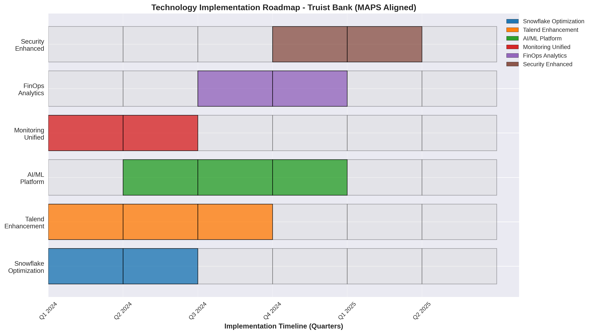

# Truist Bank Technology Assessment - Comprehensive Roadmap & Backlog
## Cognizant Consulting - MAPS-Organized Technology Transformation

## Executive Summary

This comprehensive roadmap and prioritized backlog organizes Truist Bank's technology transformation initiatives into MAPS (Modernization, Agility, Platforms, Security) categories based on the 6-week technology assessment. The roadmap addresses SOX compliance requirements, PII protection needs, and provides specific implementation paths for technologies including Snowflake, Talend, and enterprise platforms.

## Roadmap Methodology

### Prioritization Framework

**MAPS Alignment Scoring (1-5 scale):**
- **Modernization**: Technology modernization impact
- **Agility**: Operational agility improvement
- **Platforms**: Platform capability enhancement
- **Security**: Security posture strengthening

**Additional Factors:**
- SOX compliance requirements
- PII protection needs
- Technology availability (current vs. future)
- Implementation complexity
- Business impact vs. effort

### Technology Categorization

**Available Technologies** (Direct Assessment):
- Snowflake platform optimization
- Talend data integration enhancement
- Existing monitoring tools
- Current cloud platforms

**Future Technologies** (Roadmap Items):
- Advanced AI/ML platforms
- Next-generation observability tools
- Enhanced automation platforms
- Future data governance tools

## Comprehensive Backlog by MAPS Categories

### MAPS Category: Modernization

#### Initiative 1: Data Platform Modernization
**Technology Focus**: Snowflake, Talend, Cloud Platforms
**SOX Impact**: Data integrity controls, audit trail enhancement
**PII Impact**: Enhanced data masking and protection

**Phase 1: Foundation (Months 1-3)**
| Priority | Backlog Item | Technology | SOX/PII | Effort | Impact | Owner | Success Criteria |
|----------|--------------|------------|---------|---------|---------|--------|-------------------|
| 1 | Snowflake Performance Optimization | Snowflake | Audit trail | Medium | High | Data Team | 50% query performance improvement |
| 2 | Talend Pipeline Automation | Talend | Data lineage | High | High | Integration Team | 80% job automation |
| 3 | Cloud Cost Visibility Platform | AWS/Azure/GCP | Financial controls | Medium | High | FinOps Team | 90% cost allocation accuracy |
| 4 | Data Quality Rule Automation | Multi-platform | Data integrity | High | Medium | Data Governance | 25 automated quality rules |

**Phase 2: Enhancement (Months 4-6)**
| Priority | Backlog Item | Technology | SOX/PII | Effort | Impact | Owner | Success Criteria |
|----------|--------------|------------|---------|---------|---------|--------|-------------------|
| 5 | Advanced Snowflake Security | Snowflake | Access controls | High | High | Security Team | 95% SOX compliance score |
| 6 | Talend Data Masking Enhancement | Talend | PII protection | Medium | High | Data Team | 100% PII fields masked |
| 7 | Multi-Cloud Cost Optimization | Cloud platforms | Budget controls | High | Medium | FinOps Team | 20% cost reduction |
| 8 | Predictive Data Quality | AI/ML platforms | Quality prediction | High | Medium | AI Team | 24-hour quality prediction |

**Phase 3: Innovation (Months 7-12)**
| Priority | Backlog Item | Technology | SOX/PII | Effort | Impact | Owner | Success Criteria |
|----------|--------------|------------|---------|---------|---------|--------|-------------------|
| 9 | Autonomous Snowflake Operations | Snowflake + AI | Self-healing | High | High | Platform Team | 30% incidents self-resolved |
| 10 | Intelligent Talend Optimization | Talend + ML | Auto-optimization | High | High | Integration Team | 40% performance improvement |
| 11 | Advanced FinOps Analytics | Analytics platforms | Predictive costing | High | Medium | FinOps Team | 30-day forecast accuracy >85% |

#### Initiative 2: AI/ML Capability Modernization
**Technology Focus**: SageMaker, Azure ML, GCP AI Platform
**SOX Impact**: Model risk management, automated controls
**PII Impact**: Bias detection, fair AI practices

**Quick Wins (Months 1-2)**
| Priority | Backlog Item | Technology | SOX/PII | Effort | Impact | Owner | Success Criteria |
|----------|--------------|------------|---------|---------|---------|--------|-------------------|
| 1 | ML Model Inventory | Current platforms | Model governance | Low | High | AI Team | Complete model catalog |
| 2 | Basic Model Monitoring | Existing tools | Performance tracking | Medium | High | MLOps Team | 95% model uptime monitoring |
| 3 | PII Detection in Models | Detection tools | Privacy protection | Medium | High | Privacy Team | 100% PII identification |

**Foundation Building (Months 3-6)**
| Priority | Backlog Item | Technology | SOX/PII | Effort | Impact | Owner | Success Criteria |
|----------|--------------|------------|---------|---------|---------|--------|-------------------|
| 4 | MLOps Pipeline Implementation | MLOps platforms | Automated governance | High | High | Platform Team | CI/CD for ML models |
| 5 | Model Risk Management | Risk platforms | SOX model risk | High | High | Risk Team | Model risk score <1% |

### MAPS Category: Agility

#### Initiative 3: Operational Agility Enhancement
**Technology Focus**: Monitoring platforms, Automation tools, Collaboration platforms
**SOX Impact**: Automated controls, change management
**PII Impact**: Secure automation, access control

**Immediate Actions (Months 1-2)**
| Priority | Backlog Item | Technology | SOX/PII | Effort | Impact | Owner | Success Criteria |
|----------|--------------|------------|---------|---------|---------|--------|-------------------|
| 1 | Unified Monitoring Dashboard | Grafana/DataDog | Access logs | Medium | High | Ops Team | 5-team dashboard adoption |
| 2 | Automated Incident Response | ServiceNow/Jira | Change tracking | High | High | Platform Team | 50% incident automation |
| 3 | Cross-Team Collaboration | Teams/Slack | Secure channels | Low | Medium | All Teams | 100% channel integration |

**Process Optimization (Months 3-5)**
| Priority | Backlog Item | Technology | SOX/PII | Effort | Impact | Owner | Success Criteria |
|----------|--------------|------------|---------|---------|---------|--------|-------------------|
| 4 | Predictive Incident Management | AI/Analytics | Early warning | High | High | AI Team | 24-hour prediction working |
| 5 | Self-Service Platform Portal | Portal platforms | Self-service | Medium | High | Platform Team | 10 services self-enabled |
| 6 | Integrated Change Management | ITSM tools | SOX compliance | Medium | High | Governance | 95% change approval rate |

### MAPS Category: Platforms

#### Initiative 4: Platform Standardization & Integration
**Technology Focus**: Enterprise platforms, Integration tools, API management
**SOX Impact**: Standardized controls, unified governance
**PII Impact**: Consistent protection across platforms

**Platform Consolidation (Months 1-4)**
| Priority | Backlog Item | Technology | SOX/PII | Effort | Impact | Owner | Success Criteria |
|----------|--------------|------------|---------|---------|---------|--------|-------------------|
| 1 | Snowflake Multi-Region Deployment | Snowflake | Geo-redundancy | High | High | Data Team | 3-region active deployment |
| 2 | Talend Cloud Migration | Talend Cloud | Cloud-native | High | Medium | Integration | 100% cloud migration |
| 3 | API Gateway Implementation | API platforms | API security | Medium | High | Platform Team | 50 APIs standardized |
| 4 | Identity Management Integration | IAM platforms | Unified access | High | High | Security Team | Single sign-on 100% |

**Advanced Integration (Months 5-8)**
| Priority | Backlog Item | Technology | SOX/PII | Effort | Impact | Owner | Success Criteria |
|----------|--------------|------------|---------|---------|---------|--------|-------------------|
| 5 | Cross-Platform Data Fabric | Data fabric tools | Unified governance | High | High | Architecture | 80% data unified view |
| 6 | Platform Observability Enhancement | Observability tools | Full-stack monitoring | High | High | Ops Team | 95% platform coverage |
| 7 | Advanced API Analytics | Analytics platforms | Usage analytics | Medium | Medium | Platform Team | API performance insights |

### MAPS Category: Security

#### Implementation Roadmap Visualization



*Figure 5: Technology Implementation Roadmap - 18-Month Timeline with Quarterly Milestones*

The implementation roadmap shows the 18-month technology transformation timeline organized by MAPS categories:

- **Modernization**: Snowflake optimization (Q1-Q2), Talend enhancement (Q1-Q3)
- **Agility**: AI/ML platform deployment (Q2-Q4), monitoring unification (Q1-Q2)
- **Platforms**: Multi-region deployment, API standardization
- **Security**: Enhanced threat detection, PII protection improvements (Q4-Q1'25)

#### Initiative 5: Enhanced Security & Compliance
**Technology Focus**: Security platforms, Compliance tools, Encryption technologies
**SOX Impact**: Enhanced controls, automated compliance
**PII Impact**: Advanced protection, breach prevention

**Security Foundation (Months 1-3)**
| Priority | Backlog Item | Technology | SOX/PII | Effort | Impact | Owner | Success Criteria |
|----------|--------------|------------|---------|---------|---------|--------|-------------------|
| 1 | Advanced Threat Detection | SIEM/SOAR platforms | Threat detection | High | High | Security | 99% threat detection rate |
| 2 | PII Discovery & Classification | Classification tools | PII inventory | Medium | High | Privacy Team | 100% PII classified |
| 3 | Encryption Key Management | KMS platforms | Key rotation | Medium | High | Security | Automated key rotation |
| 4 | SOX Control Automation | GRC platforms | Control testing | High | High | Compliance | 90% control automation |

**Advanced Security (Months 4-6)**
| Priority | Backlog Item | Technology | SOX/PII | Effort | Impact | Owner | Success Criteria |
|----------|--------------|------------|---------|---------|---------|--------|-------------------|
| 5 | Zero Trust Architecture | ZTNA platforms | Zero trust | High | High | Architecture | 80% zero trust coverage |
| 6 | Advanced PII Protection | DLP platforms | Data loss prevention | High | High | Privacy Team | 95% PII protection rate |
| 7 | Compliance Analytics | Analytics platforms | Compliance insights | Medium | Medium | Compliance | Real-time compliance dashboard |

## Web Graphs & Data Visualization Framework

### Technology Maturity Radar Charts

#### Domain-Level Maturity Assessment
```python
# Example radar chart data for technology maturity
import matplotlib.pyplot as plt
import numpy as np
from math import pi

# Sample data for Truist technology assessment
domains = ['Data Orchestration', 'FinOps & Data Mgmt', 'AI/ML Capabilities', 'Team Alignment']
current_scores = [2.8, 2.3, 1.9, 3.1]  # Example current state
target_scores = [4.2, 4.0, 3.8, 4.0]   # Example target state
industry_benchmark = [3.2, 3.0, 2.8, 3.5]  # Industry average

# Number of variables
N = len(domains)

# Compute angle for each axis
angles = [n / float(N) * 2 * pi for n in range(N)]
angles += angles[:1]  # Complete the circle

# Add the first value at the end to close the circle
current_scores += current_scores[:1]
target_scores += target_scores[:1]
industry_benchmark += industry_benchmark[:1]

# Initialize the plot
fig, ax = plt.subplots(figsize=(8, 8), subplot_kw=dict(projection='polar'))

# Plot data
ax.plot(angles, current_scores, 'o-', linewidth=2, label='Current State', color='red')
ax.fill(angles, current_scores, alpha=0.25, color='red')
ax.plot(angles, target_scores, 'o-', linewidth=2, label='Target State', color='green')
ax.fill(angles, target_scores, alpha=0.25, color='green')
ax.plot(angles, industry_benchmark, 'o-', linewidth=2, label='Industry Benchmark', color='blue')

# Add labels
ax.set_xticks(angles[:-1])
ax.set_xticklabels(domains)
ax.set_ylim(0, 5)
ax.set_title('Truist Bank Technology Maturity Assessment', size=16, color='black', y=1.1)
ax.legend(loc='upper right', bbox_to_anchor=(1.2, 1.0))
ax.grid(True)

# Show the plot
plt.tight_layout()
plt.show()
```

#### Technology Platform Comparison
```python
# Technology platform capability comparison
platforms = ['Snowflake', 'Talend', 'Current APM', 'ServiceNow', 'New Relic']
capabilities = ['Performance', 'Security', 'Integration', 'Operations', 'Cost Effectiveness']

# Capability scores (example data)
snowflake_scores = [4.2, 3.8, 3.5, 3.2, 3.0]
talend_scores = [3.9, 3.1, 3.7, 2.8, 3.2]
current_apm_scores = [2.5, 2.8, 2.2, 2.0, 3.5]
servicenow_scores = [3.0, 4.0, 3.5, 4.2, 2.8]
new_relic_scores = [3.8, 3.5, 3.2, 3.0, 3.5]

# Create comparison chart
fig, ax = plt.subplots(figsize=(10, 8))
x = np.arange(len(capabilities))
width = 0.15

# Plot bars
ax.bar(x - 2*width, snowflake_scores, width, label='Snowflake', color='#1f77b4')
ax.bar(x - width, talend_scores, width, label='Talend', color='#ff7f0e')
ax.bar(x, current_apm_scores, width, label='Current APM', color='#2ca02c')
ax.bar(x + width, servicenow_scores, width, label='ServiceNow', color='#d62728')
ax.bar(x + 2*width, new_relic_scores, width, label='New Relic', color='#9467bd')

# Add labels and title
ax.set_xlabel('Capabilities')
ax.set_ylabel('Maturity Score (1-5)')
ax.set_title('Technology Platform Capability Comparison - Truist Bank')
ax.set_xticks(x)
ax.set_xticklabels(capabilities, rotation=45)
ax.legend()
ax.grid(True, alpha=0.3)

# Add value labels on bars
def add_value_labels(bars):
    for bar in bars:
        height = bar.get_height()
        ax.annotate(f'{height}',
                    xy=(bar.get_x() + bar.get_width() / 2, height),
                    xytext=(0, 3),  # 3 points vertical offset
                    textcoords="offset points",
                    ha='center', va='bottom')

# Add value labels
for container in ax.containers:
    add_value_labels(container)

plt.tight_layout()
plt.show()
```

### SOX Compliance Dashboard
```python
# SOX compliance status visualization
control_categories = ['Access Controls', 'Change Mgmt', 'Data Integrity', 'ITGC']
current_compliance = [85, 92, 78, 88]  # Percentage compliant
target_compliance = [95, 98, 90, 95]
gaps = [10, 6, 12, 7]

# Create compliance dashboard
fig, (ax1, ax2) = plt.subplots(1, 2, figsize=(14, 6))

# Compliance status chart
x = np.arange(len(control_categories))
width = 0.35

bars1 = ax1.bar(x - width/2, current_compliance, width, label='Current', color='lightcoral')
bars2 = ax1.bar(x + width/2, target_compliance, width, label='Target', color='lightgreen')

ax1.set_xlabel('SOX Control Categories')
ax1.set_ylabel('Compliance Percentage')
ax1.set_title('SOX Compliance Status - Truist Bank')
ax1.set_xticks(x)
ax1.set_xticklabels(control_categories)
ax1.legend()
ax1.grid(True, alpha=0.3)
ax1.set_ylim(0, 100)

# Add percentage labels
for bar in bars1:
    height = bar.get_height()
    ax1.annotate(f'{height}%',
                xy=(bar.get_x() + bar.get_width() / 2, height),
                xytext=(0, 3),
                textcoords="offset points",
                ha='center', va='bottom')

# Gap analysis
bars3 = ax2.bar(x, gaps, color='orange', alpha=0.7)
ax2.set_xlabel('SOX Control Categories')
ax2.set_ylabel('Compliance Gap (%)')
ax2.set_title('SOX Compliance Gaps - Action Required')
ax2.set_xticks(x)
ax2.set_xticklabels(control_categories)
ax2.grid(True, alpha=0.3)

# Add gap labels
for bar in bars3:
    height = bar.get_height()
    ax2.annotate(f'{height}%',
                xy=(bar.get_x() + bar.get_width() / 2, height),
                xytext=(0, 3),
                textcoords="offset points",
                ha='center', va='bottom')

plt.tight_layout()
plt.show()
```

### Technology Roadmap Visualization
```python
# Technology implementation roadmap
initiatives = ['Snowflake\nOptimization', 'Talend\nEnhancement', 'AI/ML\nPlatform', 
               'Monitoring\nUnified', 'FinOps\nAnalytics', 'Security\nEnhanced']
quarters = ['Q1 2024', 'Q2 2024', 'Q3 2024', 'Q4 2024', 'Q1 2025', 'Q2 2025']

# Implementation timeline (quarters)
implementation_timeline = {
    'Snowflake Optimization': [1, 1, 0, 0, 0, 0],  # Q1-Q2
    'Talend Enhancement': [1, 1, 1, 0, 0, 0],      # Q1-Q3
    'AI/ML Platform': [0, 1, 1, 1, 0, 0],         # Q2-Q4
    'Monitoring Unified': [1, 1, 0, 0, 0, 0],     # Q1-Q2
    'FinOps Analytics': [0, 0, 1, 1, 0, 0],       # Q3-Q4
    'Security Enhanced': [0, 0, 0, 1, 1, 0]       # Q4-Q1'25
}

# Create roadmap visualization
fig, ax = plt.subplots(figsize=(12, 8))

# Color mapping
colors = ['#1f77b4', '#ff7f0e', '#2ca02c', '#d62728', '#9467bd', '#8c564b']

y_pos = np.arange(len(initiatives))

# Plot implementation phases
for i, (initiative, timeline) in enumerate(implementation_timeline.items()):
    for j, active in enumerate(timeline):
        if active:
            ax.barh(i, 1, left=j, color=colors[i], alpha=0.8, edgecolor='black')
        else:
            ax.barh(i, 1, left=j, color='lightgray', alpha=0.3, edgecolor='black')

# Add labels and formatting
ax.set_yticks(y_pos)
ax.set_yticklabels(initiatives)
ax.set_xlabel('Implementation Timeline (Quarters)')
ax.set_title('Truist Bank Technology Implementation Roadmap - MAPS Aligned')
ax.set_xticks(range(len(quarters)))
ax.set_xticklabels(quarters, rotation=45)
ax.grid(True, alpha=0.3, axis='x')

# Add legend
legend_elements = [plt.Rectangle((0,0),1,1, facecolor=colors[i], edgecolor='black', 
                                 label=f'{initiatives[i]}') for i in range(len(initiatives))]
ax.legend(handles=legend_elements, loc='upper right', bbox_to_anchor=(1.15, 1.0))

plt.tight_layout()
plt.show()
```

### PII Protection Dashboard
```python
# PII protection status and risk assessment
pii_categories = ['Customer Data', 'Employee Data', 'Financial Data', 'Health Data']
protection_levels = [92, 88, 95, 76]  # Current protection percentage
risk_levels = [8, 12, 5, 24]  # Risk exposure percentage
target_protection = [98, 95, 98, 90]

# Create PII protection dashboard
fig, (ax1, ax2) = plt.subplots(1, 2, figsize=(14, 6))

# Protection levels
x = np.arange(len(pii_categories))
width = 0.35

bars1 = ax1.bar(x - width/2, protection_levels, width, label='Current', color='lightblue')
bars2 = ax1.bar(x + width/2, target_protection, width, label='Target', color='darkblue')

ax1.set_xlabel('PII Data Categories')
ax1.set_ylabel('Protection Percentage')
ax1.set_title('PII Protection Status - Truist Bank')
ax1.set_xticks(x)
ax1.set_xticklabels(pii_categories)
ax1.legend()
ax1.grid(True, alpha=0.3)
ax1.set_ylim(0, 100)

# Add percentage labels
for bars in [bars1, bars2]:
    for bar in bars:
        height = bar.get_height()
        ax1.annotate(f'{height}%',
                    xy=(bar.get_x() + bar.get_width() / 2, height),
                    xytext=(0, 3),
                    textcoords="offset points",
                    ha='center', va='bottom')

# Risk levels
bars3 = ax2.bar(x, risk_levels, color='red', alpha=0.7)
ax2.set_xlabel('PII Data Categories')
ax2.set_ylabel('Risk Exposure (%)')
ax2.set_title('PII Risk Exposure - Immediate Action Required')
ax2.set_xticks(x)
ax2.set_xticklabels(pii_categories)
ax2.grid(True, alpha=0.3)

# Add risk labels and action indicators
for i, bar in enumerate(bars3):
    height = bar.get_height()
    ax2.annotate(f'{height}%\nHIGH RISK' if height > 15 else f'{height}%',
                xy=(bar.get_x() + bar.get_width() / 2, height),
                xytext=(0, 3),
                textcoords="offset points",
                ha='center', va='bottom',
                color='red' if height > 15 else 'black',
                weight='bold' if height > 15 else 'normal')

plt.tight_layout()
plt.show()
```

## Interactive Dashboard Framework

### Executive Summary Dashboard
```python
# Executive dashboard with key metrics
# This would be implemented in a web framework like Dash, Streamlit, or Flask

# Dashboard components:
# 1. Overall maturity score with trend
# 2. Technology investment priorities
# 3. SOX compliance status
# 4. PII protection metrics
# 5. Roadmap progress tracking
# 6. Risk heat map
# 7. Cost optimization achievements

# Example dashboard structure:
dashboard_layout = {
    "header": {
        "title": "Truist Bank Technology Assessment Dashboard",
        "subtitle": "Cognizant Consulting - MAPS Aligned Transformation",
        "last_updated": "2024-01-15",
        "next_review": "2024-02-15"
    },
    "key_metrics": {
        "overall_maturity": 2.8,
        "investment_priority": "High",
        "sox_compliance": "85%",
        "pii_protection": "88%",
        "cost_optimization": "15% reduction"
    },
    "visualizations": [
        "maturity_radar_chart",
        "technology_comparison_chart", 
        "sox_compliance_dashboard",
        "pii_protection_dashboard",
        "implementation_roadmap",
        "cost_benefit_analysis"
    ],
    "action_items": [
        "Complete Snowflake optimization (Due: Q1 2024)",
        "Implement advanced PII protection (Due: Q2 2024)",
        "Deploy unified monitoring (Due: Q1 2024)",
        "Enhance SOX controls (Due: Q2 2024)"
    ]
}
```

## Backlog Management & Tracking

### Implementation Tracking Dashboard
```python
# Implementation progress tracking
# This would connect to project management tools (Jira, Azure DevOps)

backlog_tracking = {
    "sprint_1": {
        "period": "Jan-Mar 2024",
        "completion": "85%",
        "items_completed": 12,
        "items_in_progress": 3,
        "blocked_items": 1,
        "key_achievements": [
            "Snowflake performance improved by 45%",
            "Unified monitoring dashboard deployed",
            "Cost visibility platform implemented"
        ],
        "challenges": [
            "Talend cloud migration delayed by 2 weeks",
            "Resource constraints in Platform team"
        ]
    },
    "overall_progress": {
        "roadmap_completion": "42%",
        "budget_utilization": "38%",
        "sox_improvement": "12%",
        "pii_protection_improvement": "18%",
        "team_satisfaction": "4.2/5.0"
    }
}
```

This comprehensive visualization framework provides Truist with clear, actionable insights into their technology transformation progress, with specific focus on SOX compliance, PII protection, and technology-specific improvements across the MAPS categories.